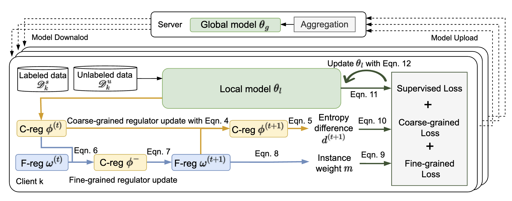

# Combating Data Imbalances in Federated Semi-supervised Learning with Dual Regulators (FedDure)

## Setup
```
conda create --name fssl python=3.9.8
conda activate feddure
```
Alternatively, you can use `pip install -r requirements.txt` to install the dependencies.

## Download Dataset
We provide experiment with two datasets: Cifar10 and CINIC10.

## Training
We provide the running scripts in `configs`, which allow you to reproduce the results on our paper.
Make sure you change the data path (`root`) in `.yaml` files.

### Cifar10
**Slurm cluster**:

- sh train_slurm.sh vi_irdc 1 ./configs/cifar10/res9_meta_pseudo_cifar10_wnet1_dir_dir_5.yaml

**Workstation**

- bash train.sh ./configs/cifar10/res9_cifar10_dir_dir_5.yaml

You run the commands for CINIC10 in a similar manner by changing the scripts.
## References
If you use this code, please cite
```
@inproceedings{bai2024combating,
  title={Combating data imbalances in federated semi-supervised learning with dual regulators},
  author={Bai, Sikai and Li, Shuaicheng and Zhuang, Weiming and Zhang, Jie and Yang, Kunlin and Hou, Jun and Yi, Shuai and Zhang, Shuai and Gao, Junyu},
  booktitle={Proceedings of the AAAI Conference on Artificial Intelligence},
  volume={38},
  number={10},
  pages={10989--10997},
  year={2024}
}
```
